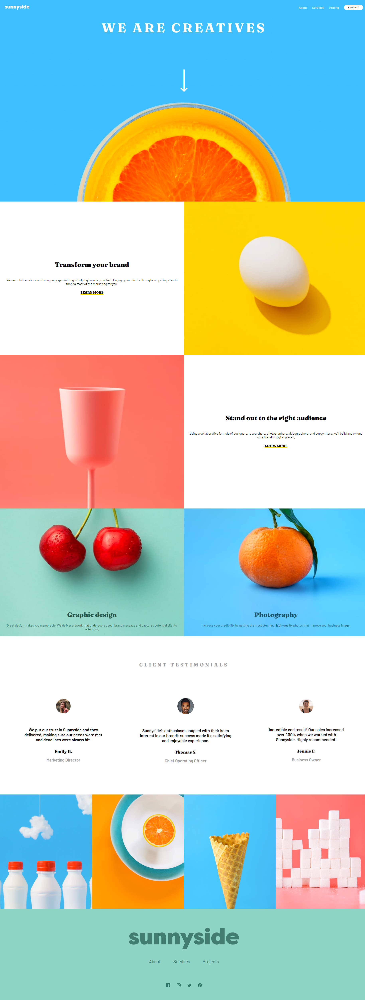

# Sunnyside - Media Agency Landing Page

This quick job wwas  a perfect test of layout and responsive skills, to see if they were still there :) 

There's a tiny bit of JS for the mobile menu, but the focus is HTML & SCSS.

## Layout

The designs were created to the following widths:

- Mobile: 375px
- Desktop: 1440px

## Demo

Live link:

https://lukas-bronski.github.io/Sunnyside-Media-Agency-Landing-Page/

## Demo

Live link:
https://lukas-bronski.github.io/Sunnyside-Media-Agency-Landing-Page/

## Features

- Mobile/ Desktop menu
- Fullscreen/mobile mode
- Cross platform

## Screenshots

